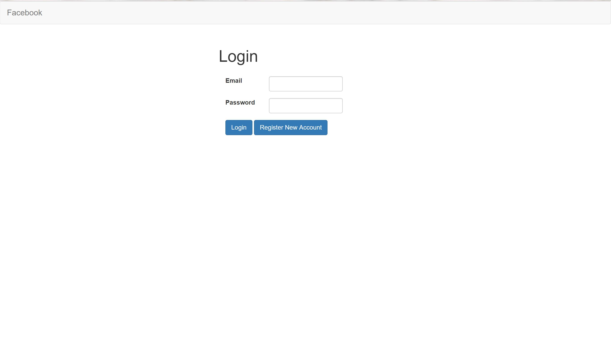
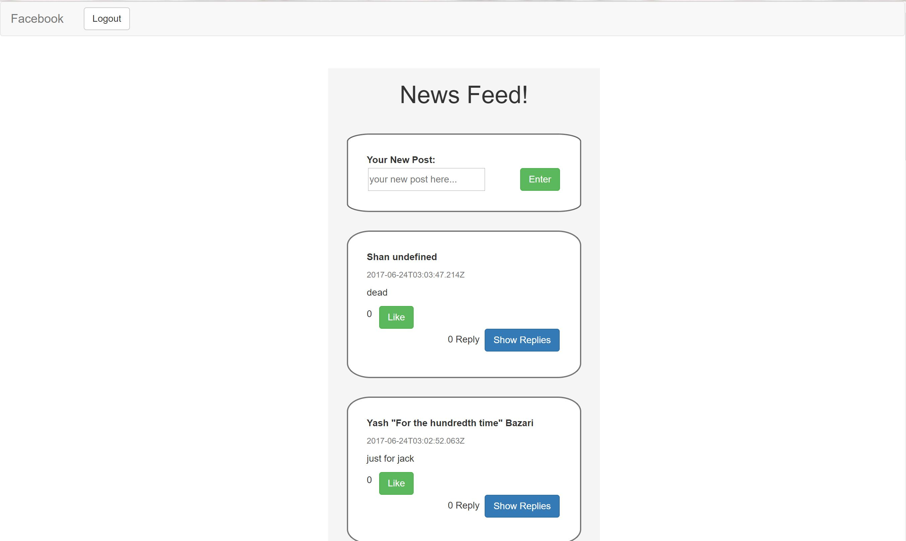

# Frontend Facebook
A minimal Facebook website built entirely on jquery and ajax

## Project Purpose

Needed a project to learn jquery and ajax with. So I built this.

## Getting Started

1. Clone the repository.

2. Open index.html. This will take you to the registration page.

3. Log in, or register an account

4. View and comment on other people's posts!

## Key Tools

jquery, ajax

## Acknowledgments

* Horizons School of Technology
